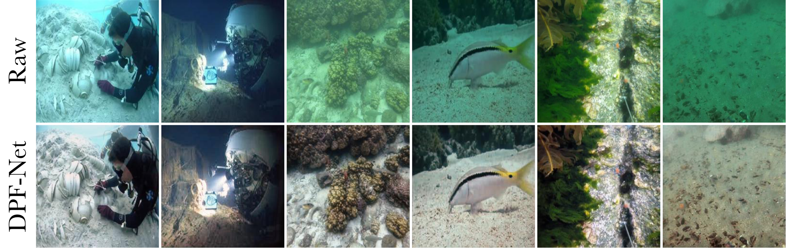

# DPF-Net 
**Physical Imaging Model Embedded Data-Driven Underwater Image Restoration Network**

## ⚙️ Setup

We ran our experiments with PyTorch 2.3.0, CUDA 12.1, Python 3.9.19 and Ubuntu 18.04.

Relative depth estimates for this project are based on Depth-Anything-V2, which you can find [here](https://github.com/DepthAnything/Depth-Anything-V2).

## 💾 Data Preparation

We mainly used the UIEB dataset. You can download the UIEB and  UIEB-Challenging dataset from [here](https://opendatalab.com/OpenDataLab/UIEB) and pre-convert the images to.jpg format. 

As for Degraded Parameters Estimation Module (DPEM), you can download the NYU-Depth-V2 dataset from [here](https://opendatalab.com/OpenDataLab/NYUv2). The absolute depth scale of each image extracted is saved in the file *./DPEM/depth_scale.txt*.

## 📦 Models

You can download the model weights we provided [here](https://drive.google.com/drive/folders/1rZe1U5Sq0IrEFXv3vV6KUIIkVb5Qa4ON?usp=sharing), including:

- **DPEM**(trained on the synthetic data in the first stage)
- **DPEM_finetune** (fine-tuned at a low learning rate in the second stage)
- **DPF-Net** (for image enhancement)
- **Depth-Anything-V2** (for generating depth maps when data is loaded, you can also substitute other MDE models if you like)

## 📊 Test

We recommend putting **DPF-Net.pth** and **DPEM_finetune.pth** in the *./checkpoint* folder and **depth_anything_v2_vits.pth** in *the ./Depth_Anything_V2_main* folder. You can test DPF-Net with:

> python test.py \
--raw_image_path /path/to/raw_images/folder \
--load_DPF_Net /path/to/checkpoint/DPF-Net \
--load_DPEM /path/to/checkpoint/DPEM_finetune \
--depth_anything_folder /path/to/depth_anything/folder

Enhancement results are saved in *./out_images* (automatically created if the folder does not already exist)

## 🕒Train

You can train DPEM with:

> python ./DPEM/train.py \
--onland_image_path path/to/NYU_Depth_V2/folder \
--underwater_image_path path/to/underwater_images/folder \
--depth_path path/to/relative_depth/folder \
--depth_anything_folder /path/to/depth_anything/folder

The above relative_depth is the relative depth images pre-generated by Depth-Anything-V2. Because the data preparation is a bit complicated, we do not recommend that you train the DPEM from scratch, and you can use the pre-training weights we provide.

Before training, place the raw images in a folder called *raw* and the reference images in a folder of the same level called *ref*. And a pre-trained DPEM is also required. We recommend that you put **DPEM.pth** in folder *./DPEM/checkpoint*. You can train DPF-Net with:

> python train.py \
--raw_image_path /path/to/raw_images/folder \
--load_DPEM /path/to/checkpoint/DPEM \
--depth_anything_folder /path/to/depth_anything/folder
